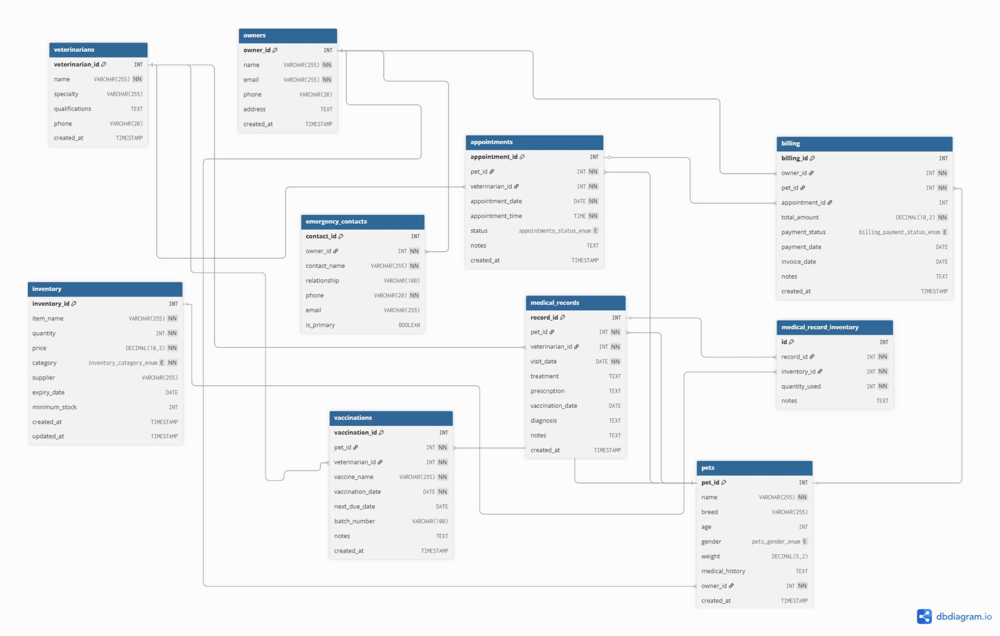
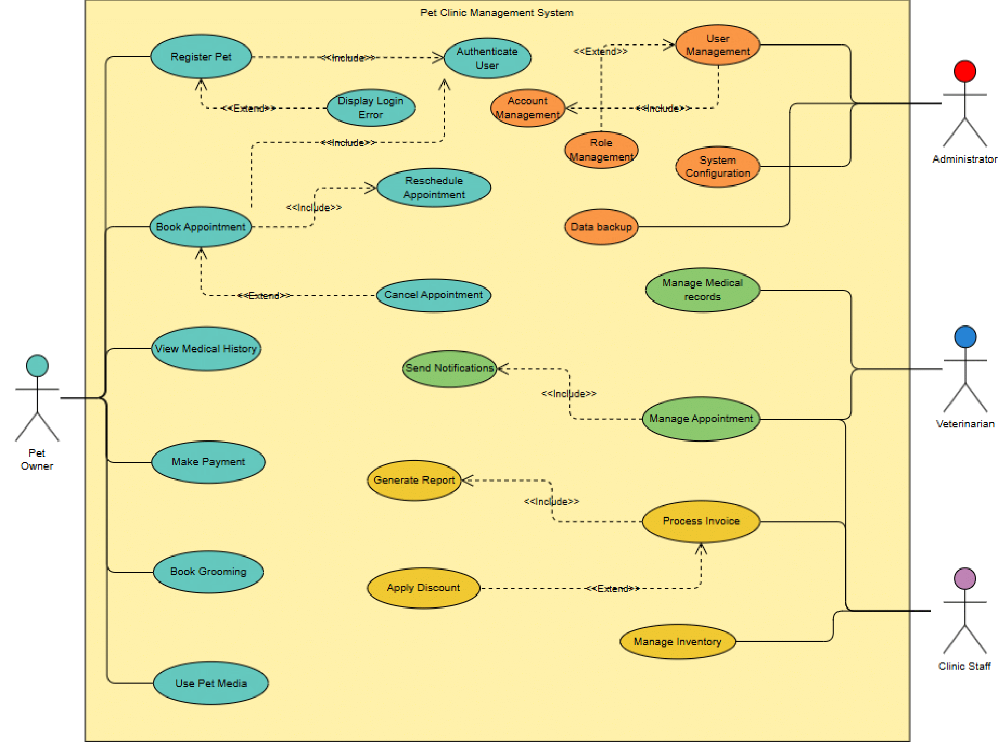
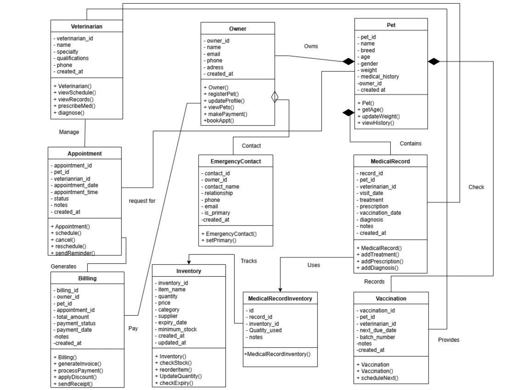
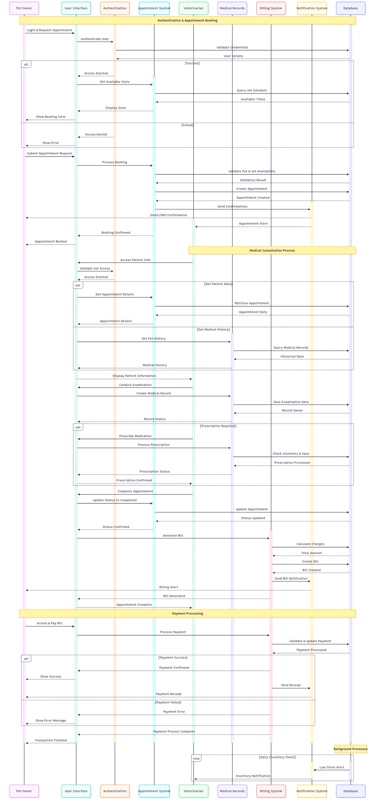

  

# PAWsitive Care
### (A Pet Clinic Management System)

# Table of Contents
- [Project Overview](#project-overview)
- [Problem Statement](#problem-statement)
- [Project Objectives](#project-objectives)
  - [Develop a Secure, Role-Based Management System](#develop-a-secure-role-based-management-system)
  - [Implement Modular System Architecture](#implement-modular-system-architecture)
  - [Incorporate Advanced Design Patterns](#incorporate-advanced-design-patterns)
  - [Enhance Operational Efficiency](#enhance-operational-efficiency)
  - [Provide Comprehensive Features](#provide-comprehensive-features)
- [End Users](#end-users)
  - [System Administrators](#system-administrators)
  - [Veterinarians](#veterinarians)
  - [Clinic Staff](#clinic-staff)
  - [Pet Owners](#pet-owners)
- [Functional Requirements](#functional-requirements)
  - [Core System Functions](#core-system-functions)
  - [Pet Profile Management](#pet-profile-management)
  - [Appointment Management System](#appointment-management-system)
  - [Medical Records Management](#medical-records-management)
  - [Billing and Financial Management](#billing-and-financial-management)
  - [Inventory Management](#inventory-management)
  - [Communication System](#communication-system)
- [Future Development / Optional Features](#future-development-optional-features)
  - [Grooming and Boarding Services](#grooming-and-boarding-services)
  - [Loyalty Program](#loyalty-program)
  - [PetMedia Social Platform](#petmedia-social-platform)
  - [Telemedicine Platform](#telemedicine-platform)
- [Non-Functional Requirements](#non-functional-requirements)
  - [Performance Requirements](#performance-requirements)
  - [Security Requirements](#security-requirements)
  - [Reliability Requirements](#reliability-requirements)
  - [Usability Requirements](#usability-requirements)
  - [Compatibility Requirements](#compatibility-requirements)
  - [Maintainability Requirements](#maintainability-requirements)
- [System Diagrams](#system-diagrams)
- [Tools & Technologies](#tools-technologies)
- [Expected Outcomes](#expected-outcomes)
- [Conclusion](#conclusion)

---

## Project Overview
The **Pet Clinic Management System** is a comprehensive web-based application built using the **Django framework** to modernize veterinary clinic operations. The system provides a centralized platform for managing pet profiles, appointments, medical records, billing, inventory, and communication between clinic staff and pet owners. 

The application features **role-based access control** with dedicated interfaces for administrators, veterinarians, clinic staff, and pet owners. Key features include real-time appointment scheduling, comprehensive medical record management, automated billing and inventory tracking, grooming and boarding services, loyalty programs, **telemedicine capabilities**, and **PetMedia** — a community platform for pet owners to share experiences and seek advice.

## Problem Statement
Veterinary clinics often rely on **manual processes** and fragmented digital tools, resulting in operational inefficiencies, missed appointments, lost medical records, and poor communication with pet owners. Manual appointment scheduling leads to double-bookings, paper-based record-keeping causes data loss, and a lack of integrated systems creates billing errors and inventory management issues. These challenges impact clinic profitability, staff productivity, and the quality of care provided to pets.

## Project Objectives

1. **Develop a Secure, Role-Based Management System**:
   - Implement comprehensive user authentication and authorization with distinct user roles and appropriate access controls to ensure data security and privacy.
  
2. **Implement Modular System Architecture**:
   - Design loosely coupled modules for pets, appointments, billing, and inventory to ensure system scalability and maintainability using **Django best practices**.

3. **Incorporate Advanced Design Patterns**:
   - Implement a minimum of **6 design patterns** to demonstrate software engineering principles and enhance system flexibility.

4. **Enhance Operational Efficiency**:
   - Automate routine administrative tasks, implement real-time notifications and reminders, and streamline workflow processes to improve clinic operations.

5. **Provide Comprehensive Features**:
   - Develop integrated appointment scheduling, medical record management, billing system, inventory control, and unique features like grooming services, loyalty programs, telemedicine, and PetMedia community platform.

## 4. End Users
The **Pet Clinic Management System** is designed to serve four distinct user categories, each with specific needs and responsibilities:

### 4.1 System Administrators
- **Role**: Complete system oversight and configuration management
- **Responsibilities**: 
  - User account management
  - System settings configuration
  - Data backup and recovery
  - System security monitoring
- **Key Features**: 
  - User role assignment
  - System configuration panels
  - Comprehensive reporting
  - Audit trail management
- **Access Level**: Full system access with administrative privileges

### 4.2 Veterinarians
- **Role**: Medical care providers and clinical decision makers
- **Responsibilities**:
  - Patient diagnosis and treatment
  - Medical record management
  - Prescription management
  - Clinical reporting
- **Key Features**:
  - Patient treatment interfaces
  - Medical record access
  - Prescription management
  - Clinical analytics dashboard
- **Access Level**: Full medical data access with treatment authorization capabilities

### 4.3 Clinic Staff
- **Role**: Operational support and customer service
- **Responsibilities**:
  - Appointment scheduling
  - Billing management
  - Inventory control
  - Customer support
- **Key Features**:
  - Appointment booking system
  - Billing interfaces
  - Inventory management
  - Customer communication tools
- **Access Level**: Limited to operational functions with restricted medical data access

### 4.4 Pet Owners
- **Role**: Primary pet caregivers and service consumers
- **Responsibilities**:
  - Pet profile management
  - Appointment booking
  - Bill payment
  - Communication with clinic
- **Key Features**:
  - Pet profile management
  - Appointment scheduling
  - Medical history viewing
  - Billing and payment
- **Access Level**: Limited to personal pet data and clinic services

---

## 5. Functional Requirements

### 5.1 Core System Functions

#### 5.1.1 Authentication and Authorization System
- **User Registration**: Account creation with basic validation
- **Login/Logout**: Secure authentication using Django's built-in system
- **Password Management**: Password reset and update functionality
- **Role-Based Access**: User roles (Admin, Veterinarian, Staff, Pet Owner)
- **Session Management**: Basic session handling and logout

#### 5.1.2 Pet Profile Management
- **Pet Registration**: Pet profile creation with basic information
- **Profile Updates**: Edit pet information and details
- **Medical History**: Basic vaccination and treatment records
- **Document Upload**: Upload and store medical documents
- **Search Functionality**: Search pets by name or owner

#### 5.1.3 Appointment Management System
- **Appointment Booking**: Schedule appointments with available time slots
- **Appointment Modification**: Edit and cancel appointments
- **Status Tracking**: Track appointment status (scheduled, completed, cancelled)
- **Basic Notifications**: Email notifications for appointments
- **Calendar View**: Display appointments in calendar format

#### 5.1.4 Medical Records Management
- **Treatment Records**: Record treatment history and notes
- **Prescription Management**: Create and manage prescriptions
- **Vaccination Tracking**: Track vaccination schedules and records
- **Clinical Notes**: Add veterinary observations and recommendations

#### 5.1.5 Billing and Financial Management
- **Invoice Generation**: Create invoices for services
- **Payment Tracking**: Record payment status and history
- **Service Pricing**: Manage pricing for different services
- **Basic Reports**: Generate simple financial reports

#### 5.1.6 Inventory Management
- **Stock Tracking**: Monitor inventory levels
- **Basic Alerts**: Simple low stock notifications
- **Category Management**: Organize inventory by categories
- **Add/Update Stock**: Manage inventory additions and updates

#### 5.1.7 Communication System
- **Email Notifications**: Send appointment reminders and updates
- **Basic Templates**: Simple email templates for common notifications
- **Announcement System**: Post clinic announcements for staff and owners

---

### 5.2 Future Development / Optional Features 

#### 5.2.1 Grooming and Boarding Services
- **Service Booking**: Schedule grooming and boarding appointments
- **Service Management**: Track service completion status
- **Basic Pricing**: Set prices for different services

#### 5.2.2 Loyalty Program
- **Points System**: Award points for visits and services
- **Basic Rewards**: Simple point redemption system
- **Customer Levels**: Basic loyalty tier classification

#### 5.2.3 PetMedia Social Platform
- **Community Posts**: Pet owners can share posts and photos
- **Basic Commenting**: Simple comment system on posts
- **User Profiles**: Basic user profiles for community interaction
- **Post Management**: Admin can moderate and manage posts

#### 5.2.4 Telemedicine Platform
- **Virtual Consultations**: Video call integration for remote consultations
- **Digital Prescriptions**: Electronic prescription management for telehealth
- **Session Recording**: Optional consultation recording for medical records
- **Secure Communication**: HIPAA-compliant communication channels

## 6. Non-Functional Requirements

### 6.1 Performance Requirements
- **Response Time**: System response time under 5 seconds for standard operations.
- **Throughput**: Support minimum 20 concurrent users.
- **Database Performance**: Optimized query performance using Django ORM best practices.

### 6.2 Security Requirements
- **Data Protection**: Secure handling of sensitive pet and owner information.
- **Access Control**: Role-based access control with Django's built-in authentication.
- **Password Security**: Secure password hashing and validation.
- **Session Management**: Secure session handling with appropriate timeouts.

### 6.3 Reliability Requirements
- **Error Handling**: Graceful error handling with user-friendly error messages.
- **Data Integrity**: Form validation and database constraints to ensure data consistency.
- **Input Validation**: Server-side validation for all user inputs.

### 6.4 Usability Requirements
- **User Interface**: Clean, intuitive web interface using the Bootstrap framework.
- **Responsive Design**: Mobile-friendly design for basic mobile device compatibility.
- **Navigation**: Clear navigation structure for different user roles.
- **Help System**: Basic help documentation and user guides.

### 6.5 Compatibility Requirements
- **Browser Support**: Compatible with modern web browsers (Chrome, Firefox, Safari, Edge).
- **Device Support**: Responsive design for desktop and basic mobile compatibility.
- **Database Support**: PostgreSQL for production deployment, SQLite for development.

### 6.6 Maintainability Requirements
- **Code Quality**: Clean, well-documented code following Django best practices.
- **Modular Design**: Organized app structure with separation of concerns.
- **Version Control**: Git-based version control with proper commit practices.
- **Documentation**: Code comments and basic technical documentation.

---

## 7. System Diagrams

### 7.1 Entity Relationship Diagram (ERD)
# 
### 7.2 Use Case Diagram
# 
### 7.3 Class Diagram
# 
### 7.4 Sequence Diagram
# 
---

## Tools & Technologies

| **Category**   | **Technologies**                        |
|----------------|-----------------------------------------|
| **Frontend**   | HTML, CSS, Bootstrap                    |
| **Backend**    | Django (Python)                         |
| **Database**   | PostgreSQL / SQLite (dev)               |
| **APIs**       | Twilio or SMTP for email/SMS notifications |
| **Version Control** | Git                                  |

---

## 8. Expected Outcomes

### 8.1 Operational Improvements
- **Efficiency Gains**: Streamlined administrative processes through digital automation.
- **Appointment Management**: Reduced scheduling conflicts through real-time availability checking.
- **Record Accuracy**: Improved data consistency through form validation and database constraints.
- **Communication Enhancement**: Better client communication through automated notifications.

### 8.2 Technical Achievements
- **System Reliability**: Functional Django-based web application with proper error handling.
- **Code Quality**: Well-structured, maintainable codebase following Django best practices.
- **Design Pattern Implementation**: Successful demonstration of 6+ software engineering design patterns.

### 8.3 User Experience Benefits
- **Role-Based Interfaces**: Customized user experiences for administrators, veterinarians, staff, and pet owners.
- **Responsive Design**: Mobile-friendly interface using Bootstrap framework.
- **Automated Workflows**: Reduced manual data entry through integrated system modules.
- **User-Friendly Navigation**: Intuitive interface design for different user roles.

### 8.4 Learning Outcomes
- **Django Framework**: Practical experience with Django web development.
- **Database Design**: Understanding of relational database design and ORM implementation.
- **Software Engineering Principles**: Application of design patterns and best practices.
- **Project Management**: Experience in collaborative software development using version control.

---

## 9. Conclusion

The **Pet Clinic Management System** represents a comprehensive solution to modern veterinary clinic management challenges using Django's robust framework and advanced software engineering principles. The system provides a scalable, secure, and user-friendly platform that addresses real-world operational inefficiencies in veterinary practices.

The project successfully demonstrates the practical application of multiple design patterns while implementing essential features such as appointment scheduling, medical record management, billing, and inventory control. Key differentiators include telemedicine capabilities, the PetMedia community platform, loyalty programs, and grooming services, positioning the system as a competitive solution in veterinary clinic management.

Through modular architecture and adherence to Django best practices, the system ensures maintainability and extensibility for future enhancements. The successful implementation will result in improved operational efficiency, enhanced customer satisfaction, and provide an excellent learning experience in modern web application development and software engineering principles.
